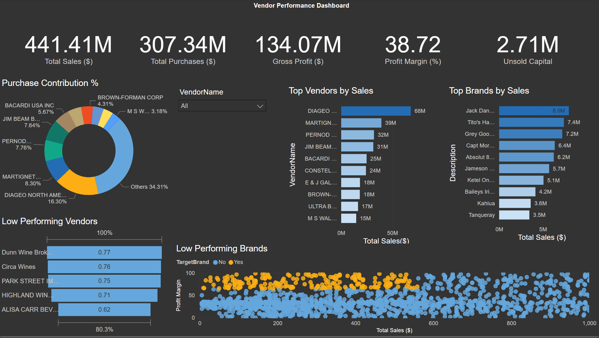

# Vendor Sales & Inventory Performance Analytics

## 📌 Business Problem
Effective inventory and sales management are critical for optimizing profitability in the retail and wholesale industry. Companies need to ensure that they are not incurring losses due to inefficient pricing, poor inventory turnover, or vendor dependency.  

The goals of this analysis were to:
- Identify underperforming brands that require promotional or pricing adjustments  
- Determine top vendors contributing to sales and gross profit  
- Analyze the impact of bulk purchasing on unit costs  
- Assess inventory turnover to reduce holding costs and improve efficiency  
- Investigate profitability variance between high-performing and low-performing vendors  

👉 Full detailed problem statement can be found in [`/Business Problem`](./Business%20Problem).  

---

## 🛠️ Tools & Technologies
- **Python (Jupyter Notebooks)** – data ingestion, exploratory analysis, vendor performance analysis  
- **MySQL Server** (running locally on Docker on macOS) – database storage & queries  
- **MySQL Workbench** – database exploration  
- **Power BI** (Windows VM) – interactive dashboard & visualization  
- **Docker** – containerized MySQL environment  

---

## 📂 Repository Structure
- [`/Setup`](./Setup) → Scripts to ingest CSVs into MySQL database  
- [`/Python Notebooks`](./Python%20Notebooks) → Exploratory data analysis & vendor performance analysis  
- [`/SQL Queries`](./SQL%20Queries) → Supporting queries for exploration & validation  
- [`/PowerBI`](./PowerBI) → Power BI dashboard project  
- [`/Business Problem`](./Business%20Problem) → Detailed problem statement  
- [`/Images`](./Images) → Relevant screenshots for dashboard & documentation  

---

## 📊 Dashboard Preview
Here is a snapshot of the interactive vendor performance dashboard created in Power BI:  

  

*(More images available in the [`/Images`](./Images) folder.)*  

---

## 🔑 Key Insights
- Identified **top vendors driving majority of gross profit**  
- Found **underperforming brands requiring price or promotional adjustments**  
- Analyzed **impact of bulk purchases on lowering per-unit cost**  
- Measured **inventory turnover rates** to highlight inefficiencies  
- Quantified **profitability gap between strong and weak vendors**  

---

## 🚀 How to Reproduce
1. Drop me a mail to recieve the CSV data since it exceeds the github limit.
2. Clone this repository  
3. Follow the setup instructions in [`/Setup`](./Setup) to ingest CSV data into MySQL (Docker required)  
4. Run analysis using notebooks in [`/Python Notebooks`](./Python%20Notebooks)  
5. Open the Power BI project from [`/PowerBI`](./PowerBI) for the interactive dashboard  

---

👤 **Author:** Naman Aggarwal  
📧 naman.agg12@gmail.com 